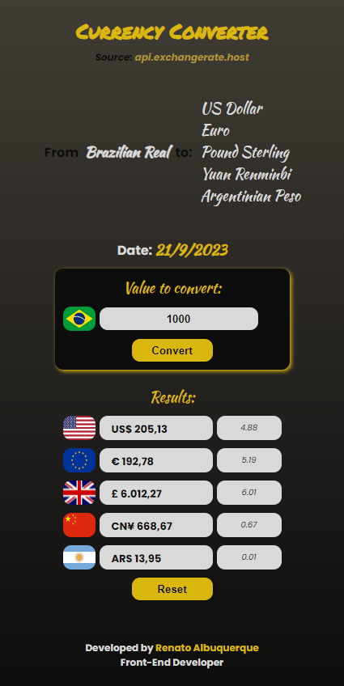

# Currency Converter App | exchangerate.host API

App that provides an easy way to convert currencies, from the Brazilian Real to: US Dollar, Euro, Pound Sterling, Yuan Renminbi, Argentinian Peso. The [exchangerate.host API](https://exchangerate.host/#/) was used.
 
"Mobile First" project developed with HTML, CSS and JavaScript.

## Table of contents

- [Overview](#overview)
  - [The challenge](#the-challenge)
  - [Screenshot](#screenshot)
  - [Links](#links)
- [My process](#my-process)
  - [Built with](#built-with)
- [Author](#author)

## Overview

### The challenge

Users should be able to:

- View the optimal layout for the site depending on their device's screen size 
- Currency converter from Brazilian Real to: US Dollar, Euro, Pound Sterling, Yuan Renminbi, Argentinian Peso.

### Screenshot

### Links

- [Solution URL here](https://github.com/renato-albuquerque/currency_converter-api)
- [Live Site URL here](https://renato-albuquerque.github.io/currency_converter-api/)

## My process

### Built with

- Semantic HTML5 markup
- CSS custom properties
- Flexbox
- JavaScript
- Fetch API | async await
- Mobile-first workflow

## Author

- Business Card - [Renato Albuquerque](https://rma-contacts.vercel.app/)
- Linkedin - [renato-malbuquerque](https://www.linkedin.com/in/renato-malbuquerque/)
- Discord - [Renato Albuquerque#0025](https://discordapp.com/users/992621595547938837)
